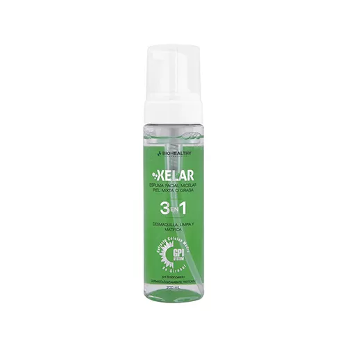
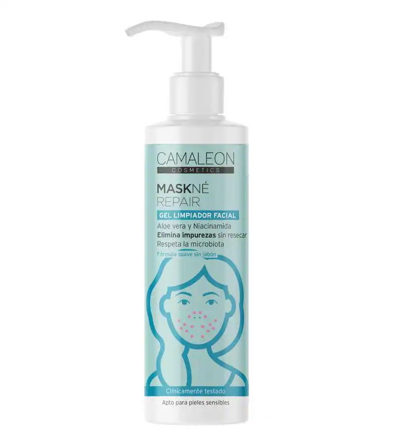

<!DOCTYPE html>
<html>

<head>
  
  <title>Natural Skin Care</title>
  <link rel="stylesheet" href="inicio.css">
</head>

<body>
    

        <video autoplay muted loop id="video-background">
            <source src="Skin Care Product example commercial.mp4" type="video/mp4">
            Tu navegador no soporta el elemento de video.
        </video>
        

            <!-- Agrega tu contenido aquí --> 
            <h1>Natural Skin Care</h1>
            
Tu piel merece lo mejor, merece Natural Skin Care

        

    

  <header>
   
  </header>
 
 
  <nav>
    <a href="#">Inicio</a>
    <a href="Productos.html">Productos</a>
    <a href="nosotros.html">Nosotros</a>
    <a href="contacto.html">Contacto</a>
  </nav>

  <main>
    <aside>

      <h2>Síguenos</h2>
      

        <a href="#">Facebook</a> 
        <a href="#">Instagram</a> 
        <a href="#">Twitter</a>
      

    </aside>

      <article>
        <h1>Nuestros Productos</h1>
        
        

          
          <h3>Espuma Facial para piel grasa</h3>
          
Limpiador suave elaborado con ingredientes 100% naturales...

          <a href="productos.html">Ver Producto</a>
        

        
        
  
           
          <h3>Crema Facial de Noche</h3>
          
Crema reparadora de cuidado excepcional para uso nocturno que gracias a sus componentes ayuda a estimular las defensas antioxidantes de la piel
 
          <a href="#">Ver Producto</a>
        

        
        

          
          <h3>Gel Hidratante</h3> 
          
Crema nutritiva y ligera para hidratar tu piel...
        
          <a href="#">Ver Producto</a>
        

        
        

          
          <h3>Gel para el Rostro</h3> 
          
Gel facial altamente hidratante que brinda una hidratación inteligente de larga duración y con un acabado mate inmediato, 
        
          <a href="#">Ver Producto</a>
        

  
        

          
          <h3>Desmaquillantes</h3> 
          
de uso diario que trata, protege y ayuda a corregir la piel del contorno frente al envejecimiento causado por los agentes agresores externos.
        
          <a href="#">Ver Producto</a>
        

        
  
      </article>
      
      
    </main>

  <footer>
    Derechos Reservados - 2023
  </footer>

</body>

</html>

body {
  
  font-family: system-ui, -apple-system, BlinkMacSystemFont, 'Segoe UI', Roboto, Oxygen, Ubuntu, Cantarell, 'Open Sans', 'Helvetica Neue', sans-serif;
    margin: 10px;
    padding: 10;
    background: url(Crema\ Simple\ Minimalista\ Viajes\ YouTube\ Banner.png) no-repeat center center fixed;
    background-size: cover;
    border-radius: 30px;
  }
  
  header {
   
    color: white;
    padding: 10px;
    text-align: center;
  }

  .video-container {
    position: relative;
    width: 100%;
    height: 100vh;
    overflow: hidden;
}

#video-background {
    position: absolute;
    top: 0;
    left: 0;
    width: 100%;
    height: 100%;
    object-fit: cover;
    z-index: -1;
}

.contenido {
    position: absolute;
    top: 50%;
    left: 50%;
    transform: translate(-50%, -50%);
    text-align: center;
    color: #fffafa;
    z-index: 1;
    font-family: 'Gill Sans', 'Gill Sans MT', Calibri, 'Trebuchet MS', sans-serif;
    font-size: 25px;
}

nav {
  background-color: #000000;
  text-align: center;
}

nav a {
  display: inline-block;
  color: #fcfcfc; 
  padding: 14px 16px;
  text-decoration: none;
  font-size: 25px;

  /* Espacio entre enlaces */
  margin-right: 20px; 
}

nav a:last-child {
   margin-right: 0;
}

nav a:hover {
  background-color: #fcfcfc;
  color: rgb(0, 0, 0);  
}

  /* nav {
    background-color: #333;
    overflow: hidden;
    text-align: center; 
  }
  
  nav a {
    display: inline-block;
    color: #fff;
    padding: 14px 16px;
    text-decoration: none;
    font-size: 17px;  
  }
  
  nav a:hover {
    background-color: #ddd;
    color: black;
  } */
  
  main {
    display: flex; 
  }
  
  aside {
    flex-basis: 30%;
    padding: 15px;
    background-color: rgb(23, 134, 125)
    ;
 
  }
  
  aside h2 {
    color: rgb(255, 255, 255);
    
  } 
  
  aside a {
    display: block;
    color: rgb(247, 247, 247);
    text-decoration: none;
    margin-bottom: 10px;
  }
  
  article {
    flex-basis: 70%;
    padding: 20px;
    background-color: rgb(107, 170, 167); 
  }  
  
  .product {
    border-radius: 5px;
    border: 1px solid #000000;
    margin-bottom: 20px;
    padding: 10px;
  }
  
  .product img {
    width: 100px;
    float: right;
    margin-right: 10px;
  } 
  
  footer {
    background-color: #000000;
    color: white;
    padding: 7px;
    text-align: center; 
  }
